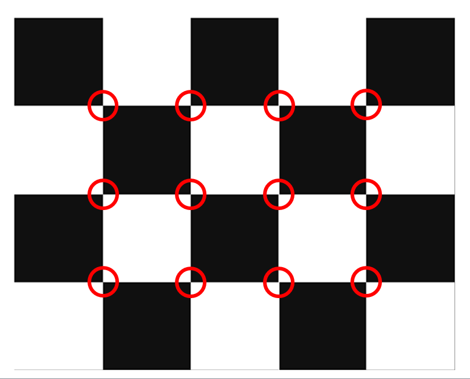

# Introduction
This repo is used to calibrate intrinsic params and the relational extrinsic params od stereo cameras. The code of this repo is from [opencv official site](https://learnopencv.com/camera-calibration-using-opencv/) and [markhedleyjones's blog](https://markhedleyjones.com/projects/calibration-checkerboard-collection).

# Chessboard
## Printing
It recommended to print the [chessboard](checkboard_src/Checkerboard-A3-35mm-10x7.pdf) in A3 paper. And the block size will be 34 mm.

## Point Counting
10x7 means the intersection points not the count of blocks. For example, the following chessboard has (4, 3) shape.


## Notice
Please ensure that the chessboard is paste to a flat surface.

## Usage
```python
from intrinsic import get_chessboard_mapping, find_intrinsic_params, undistort
WIDTH, HEIGHT = 710, 710 # image size
PIXEL_SIZE = 0.00274 * 4 # in mm(µm/1000) unit, no need if focal length (in mm unit) not needed
CHECKERBOARD = (7, 10) # the `point` (not block) on the chessboard
BLOCK_SIZE = 34 # in mm unit, the size of the block on the chessboard
img_dir = 'chessboard'
img_fps = glob.glob(img_dir+r'\*.png')

# get intrinsic params
objpoints, imgpoints = get_chessboard_mapping(img_fps, CHECKERBOARD, BLOCK_SIZE, imshow=False)
ret, mtx_ori, dist, rvecs, tvecs, mtx, roi = find_intrinsic_params(objpoints, imgpoints, (HEIGHT, WIDTH))

# apply to calibrate images
imgs = [undistort(cv2.imread(img_fp), mtx_ori, dist, mtx) for img_fp in img_fps]
```

# Scripts
1. intrinsic: 
    - get_chessboard_mapping: map the location of chessboard on the image.
    - find_intrinsic_params: Put the chessboard location from multiple images to get the intrinsic params.
    - undistort: Use the intrinsic params to calibrate the image.
    - plot_3d_eval: Plot the camera location of each image.
    - Usage:
    ```
    python intrinsic.py
    ```

2. intrinsic_eval: 
    - Intro: Validate the performance of intrinsic calibration. Calculate the intrinsic params from the calibrated image and compare both intrinsic params. if intrinsic params of calibrated image is smaller, the calibration is success. Take the following result for example, calibrated distortion coefficient is smaller than uncalibrated one. As a result, the calibration is success.
    ```
    uncalibrated dist [[ 0.01000685 -0.04064247  0.00164267  0.00092834  0.04390772]]
    calibrated dist [[ 0.00083999  0.0018685   0.00036592 -0.00045816 -0.00323504]]
    ```
    - Usage
    ```
    python intrinsic_eval.py
    ```

3. extrinsic: 
    - Intro: Calibrate the relation location and rotation of stereo camera. **This is not finished.**.

4. aero_triangulation: provide aero_triangulation calculation functions to do the conversion between 2D image pixels and 3D real-world points.

# Data
1. Location: Z:\R014_Jeremy\RawData\CamCalibration
```
├─assets
│  ├─checkboard_src     
│  └─chessboard_shortcut
├─images
│  ├─Stereo20210723     
│  │  ├─videocap_20210723180801
│  │  ├─videocap_20210723181402
│  │  ├─videocap_20210723181858
│  │  └─videocap_20210723182805
│  ├─Stereo20210726
│  │  ├─videocap_20210726170727
│  │  └─videocap_20210727152040
│  ├─Stereo20210727
│  │  ├─videocap_20210728164254
│  │  └─videocap_20210728165049
│  └─Testing
│      ├─videocap_20210706164922
│      ├─videocap_20210707121346
│      └─videocap_20210707130315
├─pkls
└─__pycache__
```

2. intro
    - images/Stereo20210726: Used for single camera intrinsic calibration.
    - images/Stereo20210727: Used for stereo camera relational extrinsic calibration.
    - pkls: Temp files.